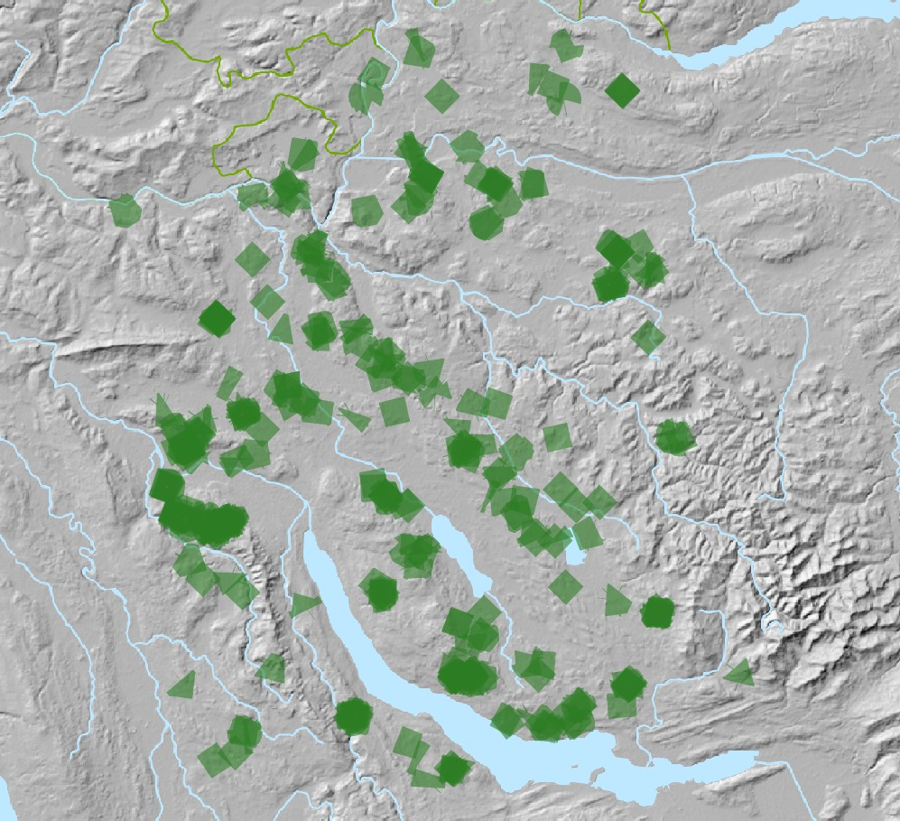
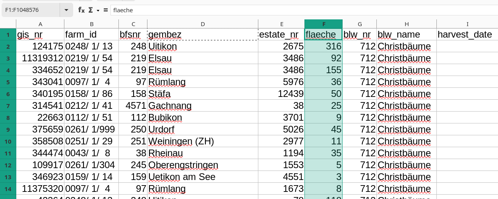

#### Did you know that almost 12 km² (11'915 [Aren](https://en.wikipedia.org/wiki/Hectare#Are)) are dedicated to the growth of Christmas trees in the Canton of Zürich? 

When the City of Zürich [posted some data](https://reciprocal.opendata.ch/project/45) about the issues of clearing away the trees after the holidays, I got thinking about where all this growth happens. It is quite phenomenal to imagine the migration of thousands of trees from the countryside and into the city, and to think about some of the sustainability issues involved. But I could not easily find a map online on this topic.

This repository is here to spark a conversation. It is a [Data Package](https://frictionlessdata.io/data-packages/) that you can load into open source software for analysis. See also [schoolofdata-ch/baumkataster-data](https://github.com/schoolofdata-ch/baumkataster-data)

Happy holidays from the Swiss open data community!

🎄🎄🎄🎄🎄🎄🎄🎄🎄🎄

# Preview

These visualizations of the data were made using the open source [QGIS](https://qgis.org) program with open access datasets from [swisstopo](https://www.swisstopo.admin.ch/en/geodata/).

_The Canton of Zürich with exaggerated locations of Christmas tree farms._

_Zooming in on a larger parcel, with satellite imagery showing neatly planted Christmas trees._

# Data

The dataset shared here is an extract of _Landwirtschaftliche Nutzungsflächen_ (Agricultural utilisation areas) of the Canton of Zürich. You can find it as open data on the portals of the [City of Zürich](https://www.stadt-zuerich.ch/geodaten/download/170) or the national open data portal:

https://opendata.swiss/de/dataset/landwirtschaftliche-nutzungsflachen

Detailed information on the geodata can be found here:

https://www.geolion.zh.ch/geodatensatz/show?gdsid=170

The data is obtained through self-declaration by farmers during structural data collection of agricultural data.

# Usage

Add a WFS / OGC API connection in the Browser of your QGIS application. Put in the link to the City of Zürich mapping service. You can find it by clicking the WFS button at the [bottom of this page](https://www.stadt-zuerich.ch/geodaten/download/170).

In a few seconds you should see a long list of layers. Scroll down until you find "Landwirtschaftliche Nutzungsflächen" and double-click to add it to your map.

To filter down to the Christmas trees, open the Attribute table by right-clicking on the layer. Note that this may take a few minutes to process - even on a fast machine and fast Internet connection. Use the filter screne, and enter the word "Christbäume" into the `blw_name` column, as in this screenshot:

You can finally add some more layers to your QGIS project - we suggest using the SWISSIMAGE or Basiskarte GIN from swisstopo, which you can load in a similar way as above - just using WMS/WMTS and not WFS - with instructions here: https://www.swisstopo.admin.ch/en/geodata/geoservices/bgdi-services.html

Then you should be able to create a map like the one shown at the top of this document.

To do some further analysis, export the filtered layer to CSV format. Then you can use [LibreOffice](https://libreoffice.org) or another tool to do some statistics on the data:

We have provided the CSV and GeoJSON versions conveniently for you in the [data folder](data/).

# License

This Data Package is made available by its maintainers under the [Public Domain Dedication and License v1.0](http://www.opendatacommons.org/licenses/pddl/1.0/), a copy of the full text of which is in [LICENSE.md](LICENSE.md).

Always check the terms of use of the original dataset before using for non-commercial or commercial purposes.
